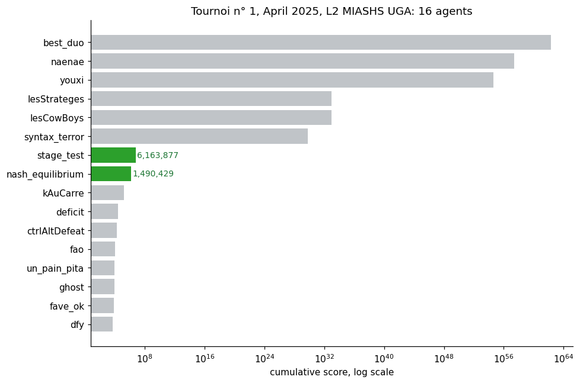

# Tournoi de stratégies : des agents Prolog dans un jeu répété

> [Read in English](README.md) · [Ouvrir sur le site ↗](https://tewf.github.io/University-Coursework/Bachelor/SecondSemestreLanguage/Prolog/StrategyTournament/)

**Auteurs :** HAMLIL Mohamed Ali Tewfik · [EL KORAICHI Mohamed Yassine](https://github.com/yassine-ek)
*Projet en binôme. Programmation logique, Licence MIASHS, Université Grenoble Alpes.*

Deux stratégies déterminées sur le papier, écrites comme agents Prolog, puis
engagées dans un tournoi à 16 agents face au reste de la promotion. L'intéressant
n'est pas leur classement, mais ce que ce classement mesure réellement.

## Résultats



`stage_test` finit **7e sur 16** avec 6 163 877 points et `nash_equilibrium`
**8e** avec 1 490 429. Ce classement se trouvait page 1 d'un journal de 636 pages.

En relisant le même journal match par match, l'ordre s'inverse :

| | agent | score cumulé | matchs gagnés |
|---|---|---:|---:|
| 1 | best_duo | 2,02 × 10⁶² | 6 sur 15 |
| 2 | naenae | 2,58 × 10⁵⁷ | 9 sur 15 |
| 6 | syntax_terror | 6,34 × 10²⁹ | **2 sur 15** |
| **7** | **stage_test** | **6 163 877** | **7 sur 15** |
| **8** | **nash_equilibrium** | **1 490 429** | 5 sur 15 |
| 13 | un_pain_pita | 9 566 | 12 sur 15 |
| 14 | ghost | 9 350 | **13 sur 15** |

Le vainqueur a gagné 6 de ses 15 matchs. L'agent qui en a gagné 13 sur 15 finit
14e. Sur les seize, finir plus bas est corrélé au fait de gagner **plus** de
matchs (Spearman +0,62 contre le rang final, p = 0,011). Les deux agents engagés
battent le vainqueur dans leur match direct, 782 à 435 et 490 335 à 4 772.

Le tournoi ne classait donc pas les agents selon leur nombre de victoires, mais
selon leur score, et ce sont deux objectifs distincts.

## Pourquoi les scores atteignent 10⁶²

Le tournoi employait une version modifiée du jeu où **répéter un nombre multiplie
son gain par ce nombre**, vérifié sur 5 050 des 5 216 répétitions consécutives du
journal. Une série de `best_duo` jouant 5 quarante fois de suite rapporte 5⁴⁰,
soit 9 × 10²⁷ sur un seul tour.

Les deux agents engagés ont été dérivés pour la version simple du jeu, et tous
deux sont sans mémoire : ils tirent dans une distribution fixe sans jamais lire
l'historique.

| agent | joue | plus longue série | répétitions |
|---|---|---:|---:|
| `stage_test` | `[0.03, 0.444, 0.203, 0.323, 0.0]` | 10 | 32,9 % |
| `nash_equilibrium` | `[0, 0, 4/9, 2/9, 1/3]` | 9 | 35,4 % |

Ces taux sont exactement ceux que produit un tirage indépendant, 34,4 % et
35,8 %. Tous les agents classés devant eux atteignent des séries de 37 à 100. Une
stratégie mixte fixe ne peut pas exploiter une règle qui récompense la répétition
délibérée, et c'est là tout l'écart entre la 7e et la 1re place.

## Le jeu

Les deux joueurs choisissent simultanément un entier de 1 à 5. Si les choix
diffèrent d'exactement un, celui qui a choisi le **plus petit** nombre prend la
somme et l'autre rien ; sinon chacun marque ce qu'il a choisi. Sous-coter d'une
unité est récompensé, donc chaque nombre invite à être sous-coté.
[`Algorithme_Explication.pdf`](Algorithme_Explication.pdf) en dérive la matrice de
gain 5 × 5 et pose la stratégie.

`stage_test` sort de [`Equilibrium_Analysis.ipynb`](Equilibrium_Analysis.ipynb),
et les constantes correspondent à l'arrondi près : `Fraction(27, 896)` → `0.03`,
`Fraction(440, 991)` → `0.444`, `Fraction(101, 497)` → `0.203`,
`Fraction(292, 905)` → `0.323`. L'analyse et l'agent soumis sont le même objet.

`stage_test` bat aussi `nash_equilibrium` en tête-à-tête, 1 414 à 661, ce qui est
l'ordre que l'analyse prévoyait.

## L'équilibre, revérifié

`Equilibrium_Analysis.ipynb` obtient `stage_test` en minimisant la somme des carrés
des gradients de gain. Sur un simplexe, cela cherche les stratégies qui rapportent
le *moins*. [`equilibrium/`](equilibrium/) refait le calcul avec le regret, la
condition correcte ici, validée sur deux jeux classiques avant d'aborder le 5 × 5.

Deux millions de tirages de `joue/3` par agent placent chaque fréquence observée à
moins de 0,0009 du poids déclaré : le Prolog joue donc bien les distributions que
l'analyse suppose. Face à `[0, 0, 4/9, 2/9, 1/3]`, les choix 3, 4 et 5 rapportent
chacun 35/9 = 3,8889 tandis que 1 et 2 rapportent 1,0000 et 3,3333, d'où un support
réduit aux trois derniers.

`stage_test` bat effectivement Nash en tête-à-tête, 3,5552 contre 3,1521, et rapporte
pourtant moins que Nash face à **chacun** des adversaires évalués, d'au moins
0,1402 : la distribution de Nash domine donc strictement `stage_test`. Celle-ci
achète son écart en cédant 0,3337 de son propre gain, l'échange même que le
classement ci-dessus sanctionne.

## Fichiers

| Fichier | Contenu |
|---------|---------|
| `Code.pl` | Quatre agents derrière `joue/3` : `stage_test` et `nash_equilibrium` (sans mémoire), `khawa_khawa` (adaptatif, meilleure réponse aux fréquences estimées de l'adversaire), `khawa_khawa_prime` |
| `Algorithme_Explication.pdf` | Le jeu, ses matrices de gain et la stratégie proposée |
| `Stage_test.pdf` | Construction de l'équilibre `stage_test` |
| `Equilibrium_Analysis.ipynb` | Le notebook dont viennent les constantes |
| `data2.pdf` | Le journal du tournoi, 636 pages |
| `results/` | Le journal converti en CSV, et le graphique ci-dessus |
| `equilibrium/` | La même dérivation refaite avec une condition correcte sur un simplexe, et chaque stratégie confrontée à toutes les autres |

`khawa_khawa` est l'agent le plus abouti, et il **n'apparaît pas du tout dans le
journal** : zéro tour, contre 1 805 pour `stage_test` et 1 813 pour
`nash_equilibrium`. Il a été construit à côté des agents engagés, sans être
engagé lui-même.

## Deux défauts du fichier, consignés plutôt que corrigés

Aucun n'a touché le tournoi, puisque seuls les deux agents sans mémoire ont été
engagés. Les deux sont dans les parties qui ne l'ont pas été.

`khawa_khawa_prime` **ne renvoie aucun coup tant que l'historique n'atteint pas
7 tours**. `prefixe(L, N, P) :- length(P, N), append(P, _, L)` exige un préfixe
d'exactement N éléments, donc échoue sur plus court, et `entropie_adv` lui en
demande 7. Un moteur attendant un coup à chaque tour n'aurait rien obtenu de cet
agent pendant les sept premiers tours de chaque match.

`random_member/2` est redéfini ligne 738 et **lève une exception** là où la
version de la bibliothèque aurait fonctionné. Il appelle
`random_between(0, N-1, I)`, passant le terme composé `N-1` là où un entier est
attendu, donc tout appel produit `Type error: integer expected, found 3-1`. La
ligne 1 importe déjà `library(random)`, qui fournit un `random_member/2`
correct, et SWI-Prolog avertit au chargement que la définition locale le masque.
On y arrive par `tirage_nash`.

## Exécuter le code

```sh
swipl -s Code.pl          # puis interroger, par exemple : joue(stage_test, [], Coup).
cd results && python3 analyse_log.py && python3 plot_leaderboard.py
cd equilibrium && python3 verify_agents.py && python3 strategy_payoffs.py
```

`analyse_log.py` compare les scores de match de chaque agent à son total au
classement et s'arrête s'ils divergent, ce qui a permis de repérer un bug
d'analyse du journal. `strategy_payoffs.py` vérifie chaque chiffre cité dans les
textes contre le calcul qui le produit, et `verify_agents.py` fixe sa graine
aléatoire : tous deux réécrivent donc leurs CSV à l'octet près.

## Prérequis

SWI-Prolog pour les agents. Python 3 avec matplotlib, et poppler-utils pour
`pdftotext`, pour régénérer les résultats. `equilibrium/requirements.txt` fixe ce
qu'exige en plus le travail sur l'équilibre.

## Supports de cours

L'énoncé du projet appartient au cours et n'est pas redistribué ici ; voir
[NOTICE](../../../../NOTICE).
