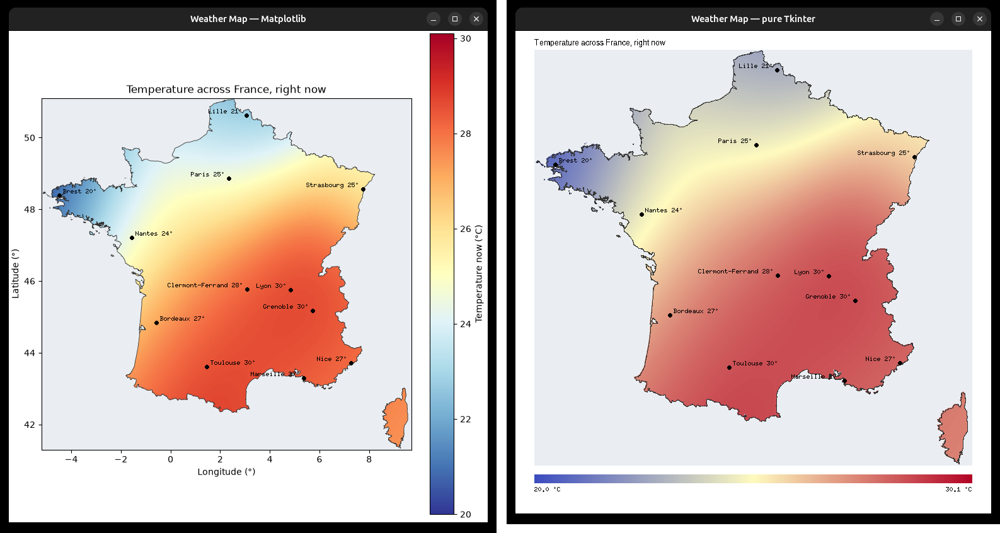

# Weather Map

TP1, Exercise 2. A Tkinter application that fetches **real-time** weather from
[Open-Meteo](https://open-meteo.com/en/docs) for twelve French cities and draws
it as a temperature map of France.



## Running it

The folder is its own `uv` project, so you never install anything by hand:

```bash
cd Master/M1/S7/Programming/Python/TP1-environments/WeatherMapApp
uv run python weather_map_matplotlib.py   # version 1: Matplotlib draws, Tkinter shows
uv run python weather_map_tkinter.py      # version 2: Tkinter draws everything itself
```

Inside the course's conda environment it runs directly, without `uv`:

```bash
conda activate m1ai-programming
python weather_map_matplotlib.py
```

The first run downloads the outline of France (about 600 kB) and keeps it in
`france_border.geojson`; every run after that reads it off the disk.

**Every module also runs on its own**, which is the quickest way to see what one
piece does without the window in the way:

```bash
uv run python meteo.py             # the twelve temperatures, as text
uv run python colour_scale.py      # 20 °C to 30 °C, as colour codes
uv run python map_projection.py    # where the corners of France land, in pixels
```

## The files

Each one has a single job, and says so in its first line.

| File | What it does | Lines |
|---|---|---|
| [configuration.py](configuration.py) | Every value you might want to change | 16 |
| [meteo.py](meteo.py) | Ask Open-Meteo, and read its answer | 43 |
| [france_border.py](france_border.py) | Provide the outline of France | 35 |
| [temperature_map.py](temperature_map.py) | Spread twelve readings over the whole country | 22 |
| [colour_scale.py](colour_scale.py) | Turn a temperature into a colour | 26 |
| [map_projection.py](map_projection.py) | Place a longitude/latitude on the canvas | 16 |
| [map_image.py](map_image.py) | Paint the temperature field into an image | 57 |
| [plots.py](plots.py) | Draw the map and the graph with Matplotlib | 42 |
| [weather_map_matplotlib.py](weather_map_matplotlib.py) | Window, version 1 | 44 |
| [weather_map_tkinter.py](weather_map_tkinter.py) | Window, version 2 | 57 |

"Lines" counts instructions only — blanks, comments and docstrings are excluded,
which is why the files look much longer than the number suggests. That is on
purpose: the explanations are the point.

## Changing something

Almost everything lives in [configuration.py](configuration.py):

- **add a city** — one line in `CITY_COORDINATES`, and it appears on both maps;
- **map somewhere else** — move the four `MINIMUM_/MAXIMUM_` bounds;
- **smoother or blockier** — `INFLUENCE_SPREAD_DEGREES`;
- **different colours** — `COLDEST_COLOUR`, `MIDDLE_COLOUR`, `HOTTEST_COLOUR`.

## Learning from it

The [guide](guide/README.md) explains how the whole thing fits together, how to lift
pieces of it into your own code, and the two or three places where the obvious
approach turns out to be a thousand times slower than the right one.
